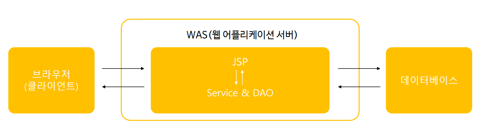
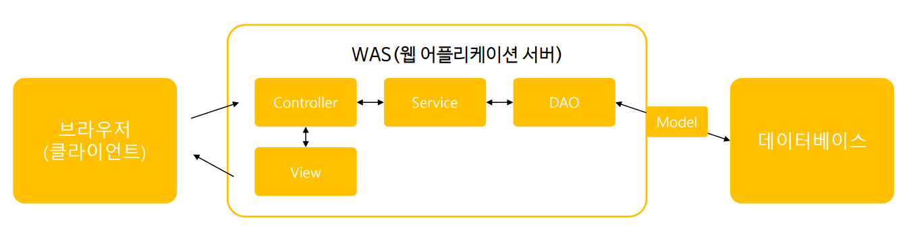

# study-spring

이곳은 Eclipse IDE에서 spring framework의 사용법을 배우기 위한 저장소입니다. 국비지원 과정에서 과제를 완성하는데 필요한 개념을 배우기 위해 만들었습니다. 목적 자체가 과제를 수행하기 위해 만들어진 저장소이기에 완벽한 이해보다는 적당한 사용법을 익히고 넘어가는 것을 우선합니다. 

학습은 다음과 같은 과정으로 진행했습니다.

* [자바 스프링 프레임워크](https://www.inflearn.com/course/%EC%8A%A4%ED%94%84%EB%A7%81-%ED%94%84%EB%A0%88%EC%9E%84%EC%9B%8C%ED%81%AC_renew/dashboard) 강의를 통한 개념 학습
* 필요한 개념만 따로 README.md 파일에 정리. 실습보다는 빠른 진도를 목표로 학습. 
* commit

# Orientation

* [스프링 프로젝트 생성](/testPjt01)
* [처음 해보는 스프링 프로젝트](/testPjt02)

# 의존 객체

DI(Dependency injection): 객체를 만들어 외부에서 주입하는 방식.

예시) 배터리 일체형 vs 배터리 분리형

### 다양한 의존 객체 주입

* 생성자를 이용한 의존 객체 주입
* setter를 이용한 의존 객체 주입: name속성을 사용하며, 이름은 set을 제외한 글자로 + 소문자로 시작
* List타입 의존 객체 주입
* Map타입 객체 주입

# 설정 및 구현

### 웹 프로그래밍 설계 모델

* 웹 프로그래밍을 구축하기 위한 설계 모델

**Model1**

모델 1의 경우: 브라우저로부터 받은 요청을 수행하는 모든 기능을 모듈화하지 않고 하나로 만듬.

* 장점 : 개발속도 빠름
* 단점 : 유지보수 어려움

Model2: 

Controller, Service, DAO 모듈화. 
* 서비스: 기능
* DAO: DB와 연결
* View: 사용자에게 보여줌

DAO는 Model객체를 통해 DB와 통신. Controller는 View객체를 통해 브라우저에 response

이 모델을 MVC라함. Model, View, Controller

장점: 유지보수가 쉽다.

---
* 스프링 MVC 프레임워크 설계 구조
* DispatcherServelet 설정
* Controller객체 - @Controller
* Controller객체 - @Requestmapping
* Controller객체 - Model 타입의 파라미터
* View 객체
* 전체적인 웹프로그래밍 구조